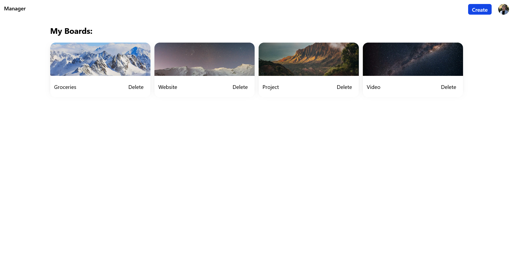
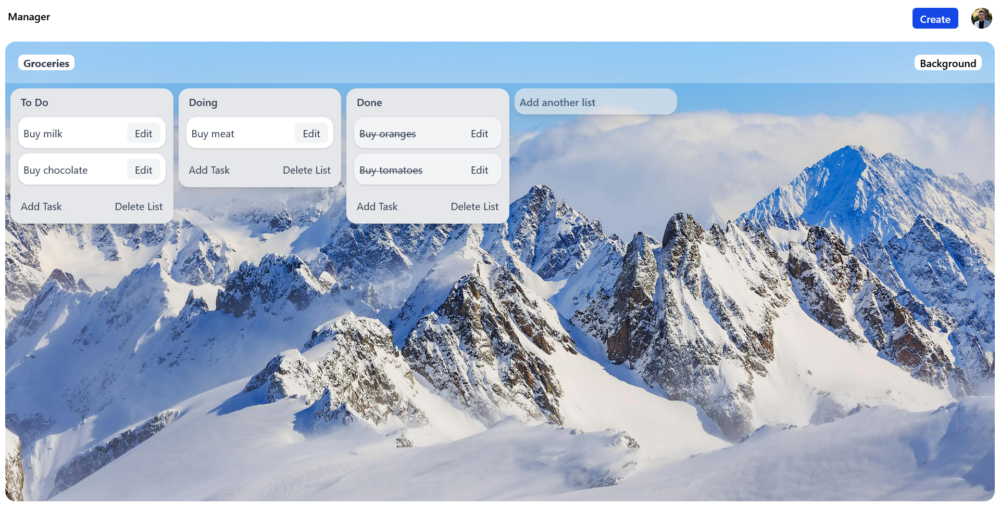
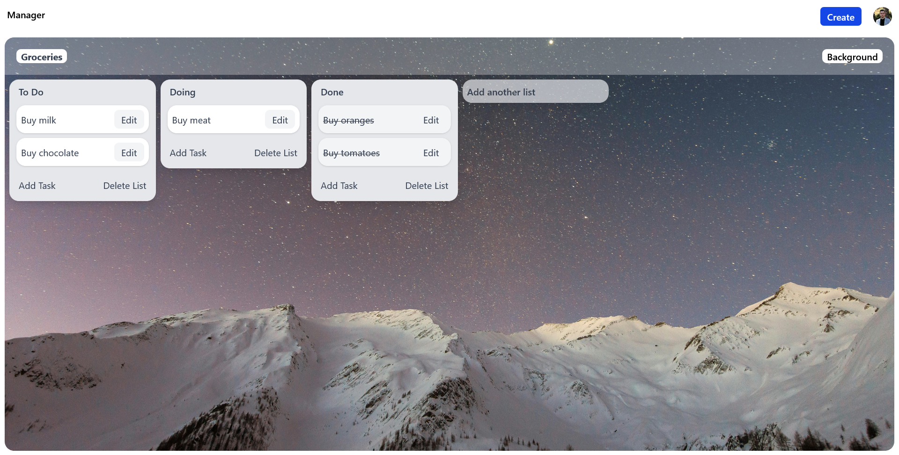
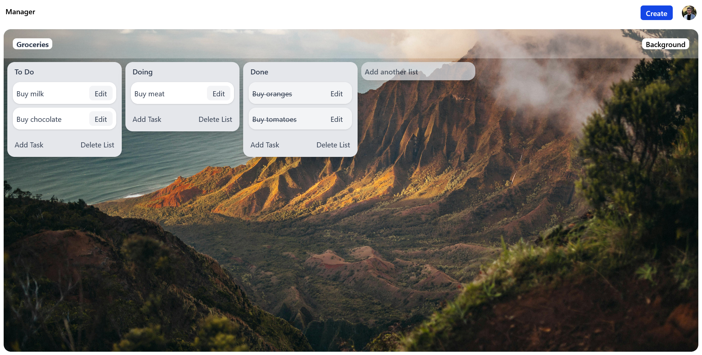
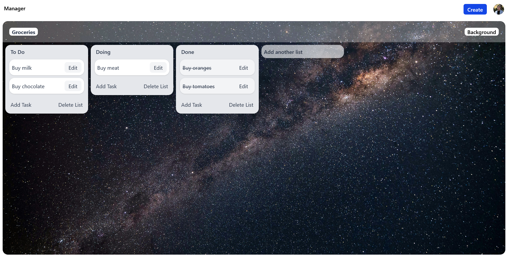
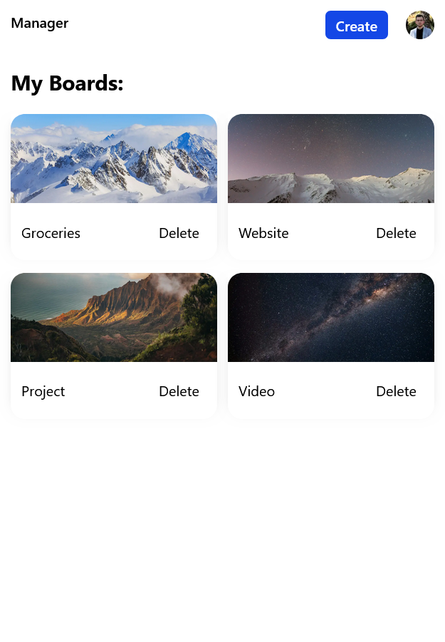
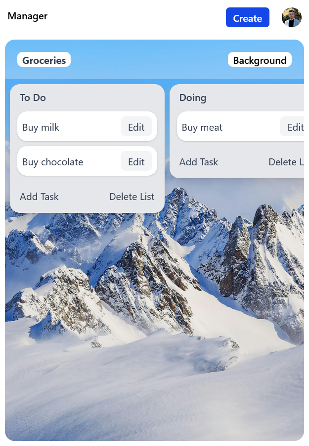
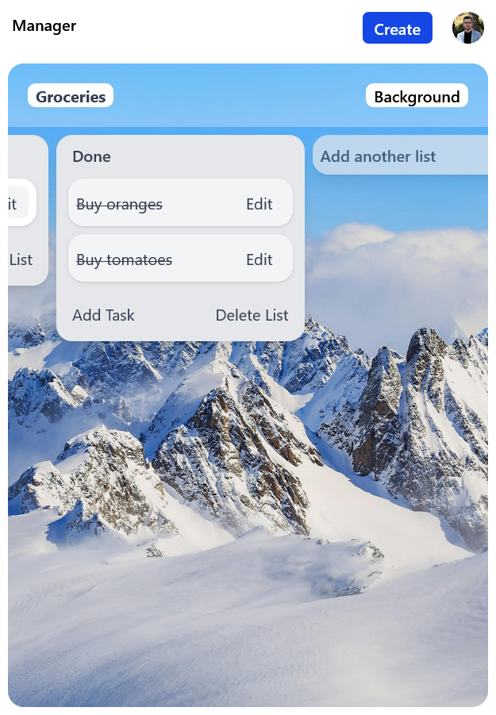

# Manager

Manager is a simple project and task management web application inspired by Trello.
It allows users to organize boards, lists, and tasks in one place to manage projects and personal work efficiently.

## Features

### Authentication

- Google authentication using Auth.js
- Secure user sessions
- Account deletion

### Boards

- Create new boards
- Choose board background images
- Rename boards
- Delete boards
- View all boards belonging to the logged-in user

### Lists

- Create lists inside boards
- Rename lists
- Delete lists

### Tasks

- Add tasks to lists
- Edit task titles
- Move tasks between lists
- Mark tasks as completed or not completed
- Delete tasks

### User Profile

- Profile menu
- Log out
- Delete account

## Tech Stack

**Frontend**

- Next.js
- React
- TypeScript
- Tailwind CSS

**Backend**

- Next.js Server Actions
- MongoDB

**Authentication**

- Auth.js (NextAuth)
- Google OAuth

**Database**

- MongoDB with MongoDB Adapter

## Database Structure

### users

Managed automatically by Auth.js.

### boards

```
{
  _id: ObjectId,
  userId: ObjectId
  title: string,
  image: string,
}
```

### lists

```
{
  _id: ObjectId,
  boardId: ObjectId,
  userId: ObjectId
  title: string,
}
```

### tasks

```
{
  _id: ObjectId,
  listId: ObjectId,
  boardId: ObjectId,
  userId: ObjectId,
  title: string,
  completed: boolean
}
```

## Installation

### 1. Clone the repository

```
git clone https://github.com/KreimerR/manager.git
cd manager
```

### 2. Install dependencies

```
npm install
```

### 3. Environment variables

Create a `.env.local` file:

```
MONGODB_URI=your_mongodb_connection_string

AUTH_SECRET=your_auth_secret

AUTH_GOOGLE_ID=your_google_client_id
AUTH_GOOGLE_SECRET=your_google_client_secret
```

## Running the project

Development server:

```
npm run dev
```

The application will run at:

```
http://localhost:3000
```

## Screenshots









